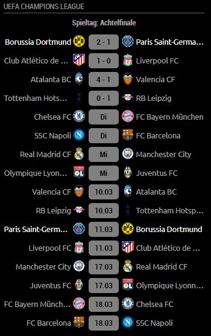
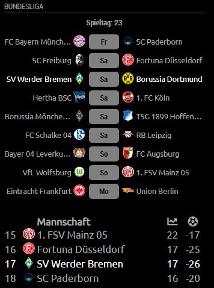

# MMM-soccer [](https://raw.githubusercontent.com/fewieden/MMM-soccer/master/LICENSE)

A Soccer Standings Module for MagicMirror², based on @fewiedens [MMM-soccer](https://github.com/fewieden/MMM-soccer)

## Examples

 

## Dependencies

* An installation of [MagicMirror²](https://github.com/MichMich/MagicMirror)
* OPTIONAL: [Voice Control](https://github.com/fewieden/MMM-voice)
* npm
* [axios](https://www.npmjs.com/package/axios)

## Installation

1. Clone this repo into your `~/MagicMirror/modules` directory.
```
git clone https://github.com/lavolp3/MMM-soccer
```
2. Run command `npm install` in `~/MagicMirror/modules/MMM-soccer` directory.
3. Add the module to your `~/MagicMirror/config/config.js`:

    ```
    {
        module: 'MMM-soccer',
        position: 'top_left',
        config: {
            api_key: '',
            show: ['CL', 'BL1', 'PL'],
            colored: true,
            updateInterval: 60,
            focus_on: {
                null
            },
            max_teams: 5,
            matchType: 'league'
        }
    },
    ```


4. Optional: Get a free api key [here](http://api.football-data.org/register) (highly recommended)


## Config Options

| **Option**            | **Default** | **Description** |
|-----------------------| --- | --- |
| `width`               | `400` | Width of match and standings table. The module has a flexible design aligning matches and table vertically or horizontically as space allows. |
| `apiKey`              | false | Either false (limited to 50 requests a day) or an API Key obtained from <http://api.football-data.org/register> (limited to 10 requests a minute) . |
| `colored`             | true | Boolean to show club logos in color or not. |
| `show`                | ['BL1', 'PL', 'CL'] | An array of league codes to be displayed. In normal mode, the leagues revolve using below update cycle. With activated touch mode (see below), you can choose one of the leagues via a button (planned) |
| `updateInterval`      | 60 | The time frame for each league to be shown in seconds. |
| `apiCallInterval`     | 10 | The time frame for API calls (in minutes) in normal mode. |
| `showMatches`         | true | Show matches of current league |
| `showTables`          | true | Show table of current league. **Note:** For cups like Champions League, this will be set to false in knockout rounds. |
| `focus_on`            | null | Which team to focus on per league. This needs to be an object, e.g. {'BL1': 'FC Bayern München', 'CL': 'Liverpool FC'}. **See description below.** |
| `fadeFocus`           | true | Includes fading the teams out if one is focused. |
| `max_teams`           | false | How many teams should be displayed when focus is activated. Omit this option or set to false to show the full league table. |
| `replace`             | 'default' | Choose between 'default' for a default replacement of original club names or 'short' for a 3-Letter-Code of the teams. Choose anything else (like '') for original team names from the API. **See below** for further information |
| `logos`               | true | Boolean to show club logos. |
| `matchType`           | 'league' | Choose between the following: `'league'` for showing the current matchday of selected leagues (in `show`), `'next'` for showing the next matches of all your focused clubs (in `focus_on`), `'daily'` for showing all of todays matches for selected leagues. |
| `numberOfNextMatches` | 8 | Defines number of next matches of all focused clubs for matchType `'next'` |
| `touchMode`           | false | Activates touch mode with touch options (see below, not active yet) |
| `debug`               | false | Debug mode: additional output on server side (console) and client side (browser) |


## Focus

You can focus on one time per league/cup using the focus_on method. This variable needs to be an object.
An example is below:
```
focus_on: {
    'BL1': 'FC Bayern München',
    'CL': 'Liverpool FC'
},
```
Please take care to include all quotation marks, separate with commata, and use the same league codes (find below) you have included in the 'show' array.
The team name needs to correspond to the original name of the team as provided by the API.
Have a look into the `replace` object in the config to see if the team name is replaced with a shorter one on the mirror. If that is the case, take the original one (the one on the left for each replace property).

Omitting a league code from `'show'` in this array will show the full league table and not include any focus.
Any league included here need to be included in `'show'` as well to show the league on your mirror.

## Replacements
There is a `replacements.json` file in the directory including all teams of the free plan. By default, the default replacement for the original team name will be used in the module. You can choose between 'default' mode or 'short' mode showing the 3-letter ID code for the team for a super slim module.


## Available competitions (Free API):

As per the [Football-data API Docs](https://www.football-data.org/documentation/api#league-codes):


| Country       | Competition                   | Code |
|---------------|-------------------------------|------|
| World         | FIFA World Cup                | WC   |
| Europe        | UEFA Champions League         | CL   |
| Europe        | European Championship         | EC   |
|               |                               |      |
| England       | Premier League                | PL   |
| Spain         | Primera Division              | PD   |
| Germany       | Bundesliga                    | BL1  |
| Italy         | Serie A                       | SA   |
| France        | Ligue 1                       | FL1  |
| Portugal      | Primeira Liga                 | PPL  |
| Netherlands   | Eredivisie                    | DED  |
| England       | Championship                  | ELC  |
| Brazil        | Campeonato Brasileiro Série A | BSA  |
